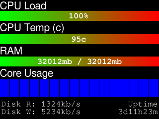

# Little Yellow System Monitor

A project I decided to make because I bought one of these cheap AliExpress LCD screens and didnt know what else I should do with it.

Requires PlatformIO in VSCode to build the firmware for the ESP32+Screen, and the service is a Linux systemd service.

## What it does

On the first run, the ESP32 creates a Wifi AP that you connect to (with your computer, phone or laptop), which asks you for your Wifi SSID and password.

Once the Wifi details are competed, they are saved to persistant storage on the ESP32, and it reboots into connected mode.

It then starts to broadcast its availability on the network.

The service sits in the background and listens for the broadcast, and when it sees a broadcast, it attempts to connect othe ESP32.

Once connected to the ESP32, the service starts sending system stats to the ESP32 for it to process and display.

The ESP32 will go to the timeout/info screen after 10 seconds of inactivity.

## How to use it

### The service

The service is currently a systemd service for linux only, and all you need to do is open a terminal, cd to the systemd directory of this project, and run `sudo make install`. No configuration needed.

### The firmware

Requires [PlatformIO](https://platformio.org/) for VSCode.

Should be able to just load up the firmware directory in PlatformIO and build/install the firmware directly to your ESP32.

## TODO

* Support more platforms (rp2040? + other screens)
* Support Linux OpenRC
* Support Windows
* Clean up the code and make it more maintainable/readable 

## Links to get your own cheap yellow ESP32

* [Little Yellow LCD 1](https://s.click.aliexpress.com/e/_c43pB65l)
* [Little Yellow LCD 2](https://s.click.aliexpress.com/e/_c3FNQDVZ)
* [Little Yellow LCD 3](https://s.click.aliexpress.com/e/_c3QTqTht)
